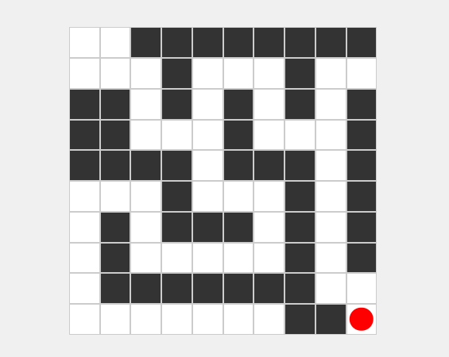

# bot-resolving-maze

A project for solving mazes using different algorithms.

### Demo

### Features
- **Algorithm** : DFS (Depth-First Search), BFS (Breadth-First Search)
- **Real-Time Movement**: The player moves through the maze in real-time as the algorithm discovers the path.
- **Dynamic Maze Exploration**: The player does not know the full maze layout initially; the maze is revealed as the player navigates through it.